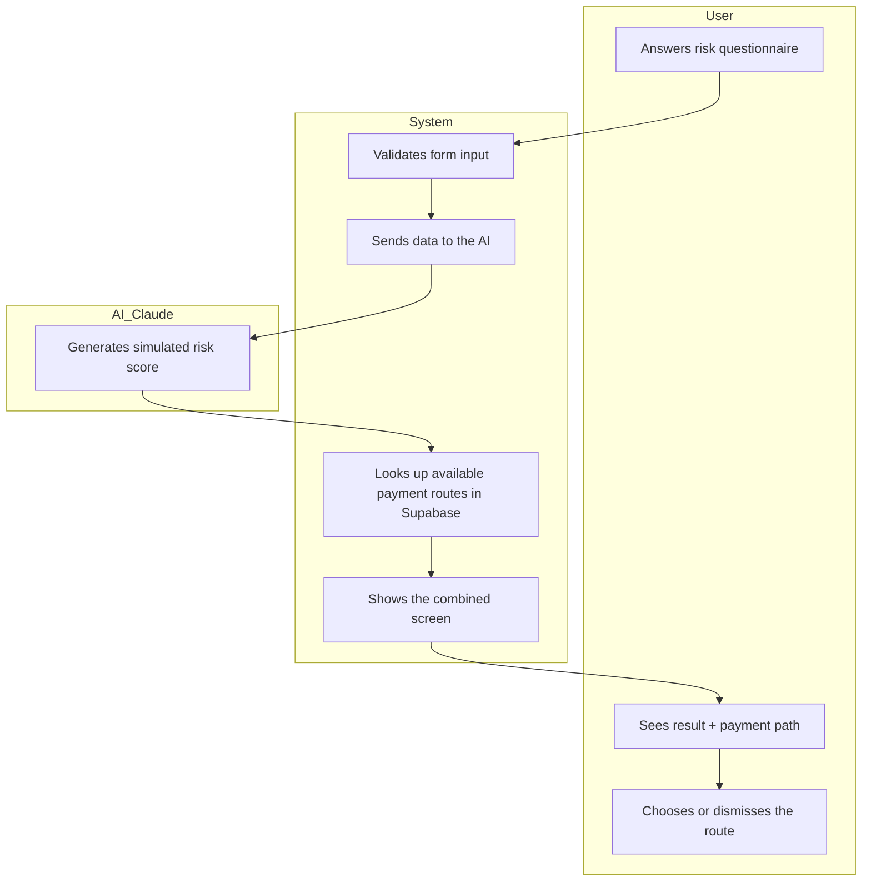

# PACKET — Weekly ship: "Risk + Payment path"
Role: MONEY · Vacuum attacked: catastrophic-cost protection

## Problem (in my words)
In Mexico, when an AI health app detects a high risk in someone without
private insurance (93% of the population), the alert arrives with no way
to pay for what comes next. Early detection got cheap thanks to AI, but
treatment is still expensive and has no financing channel attached — so
early diagnosis ends up delivering anxiety instead of care.

## Exact user
Doña Carmen, 55, sells food on the street (informal worker), no private
insurance, symptoms consistent with type 2 diabetes but no diagnosis. Uses
WhatsApp, distrusts new apps, has a variable day-to-day income and no
cushion for an unexpected medical expense.

## Success definition
Before the module closes, Doña Carmen can answer a 2-minute risk
questionnaire in the app, receive an AI-generated risk score, and see — on
the same results screen — at least one concrete payment path (a simulated
installment plan, a route into IMSS-Bienestar, or a community fund) before
the session ends.

## Mockup
Single screen: risk result (labeled as simulated, not a medical diagnosis)
+ payment path shown at the same time, with a button to see the route in
detail. (Generated as an interactive widget in this conversation —
screenshot available for the repo.)

## Flow (Mermaid)

## Benchmark
The best existing solution on Earth is PROSPERiA (Mexico) and apps like Ada
Health: they detect early risk with AI but stop there. Mine differs by
never showing a high-risk result without showing, on the same screen, a
concrete payment path — closing the gap between detection and financial
action that those solutions leave open.

## Long view (3 years)
If this slice works, in 3 years this becomes a national financial-health
rail: any screening app (public or private) can plug into this layer to
pair its result with a locally verified payment route — a family fund, a
negotiated pharmacy discount, or a fast-tracked IMSS-Bienestar appointment.
It would integrate with real fintechs and pharmacy chains to actually
process payments, not just point to them. Its long-term value isn't the
risk score — it's becoming the trusted rail that closes the gap between
"you're at risk" and "here's how it's paid for."

## Scope cut (what I'm NOT building this week)
- No COFEPRIS-validated medical model — the score is simulated and labeled
  as such on screen.
- No real payment processing or bank/fintech integration.
- No employer or insurer dashboard.
- No real IMSS API integration — the route is a simulated quote.
- No multi-language support.

## Architecture + stack

| Layer               | Tool                                                        |
|----------------------|--------------------------------------------------------------|
| Frontend             | Next.js + Vercel                                              |
| Auth                 | Supabase Auth (email + password)                              |
| Database             | Supabase Postgres, Row Level Security enabled                 |
| AI                   | Claude API (risk score + explanation)                         |
| Payment paths        | Simulated table in Supabase, invented and labeled data        |
| Input validation     | Form validation (length, type) before saving or sending to AI |
| Secrets              | Vercel environment variables, never in the repo               |

## Test plan
1. **Mechanical pass**: submit the questionnaire empty or with excessively
   long text → should be rejected with a clear message, without reaching
   the AI or the database. Complete the questionnaire validly → a score
   must be generated and at least one payment path must appear on the same
   screen. Find at least one real bug, fix it, redeploy.
2. **Persona test (Doña Carmen, 55, informal worker, distrusts apps)**:
   paste the screenshots in order into a fresh chat with that persona and
   ask her to attempt the flow, narrating out loud where she hesitates,
   what she doesn't understand, where she'd give up. Log every point of
   confusion and fix the worst one before the deadline.

## Security floor (checklist)
- [ ] No secrets in code or in the repo (Vercel env vars only)
- [ ] Auth via Supabase (email + password) because questionnaire answers
      are personal data
- [ ] Row Level Security enabled on every table holding user data
- [ ] Every form validates length and type before touching the DB or the
      AI prompt
- [ ] Zero real personal data of real people in demos or seeds — all data
      invented and labeled
